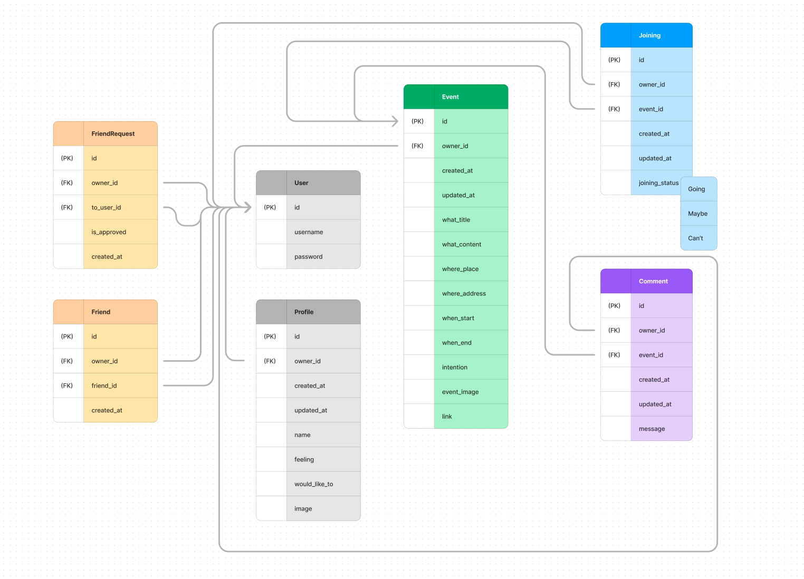
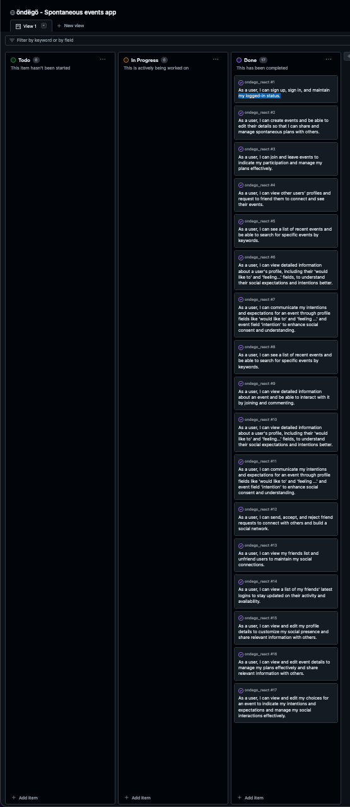

# öndëgö API | README

Visit the deployed [ödëgö API here](https://ondego-api.herokuapp.com/)

## Overview

**öndëgö API** is the backend for the öndëgö application, a spontaneous event planning application that allows users to create and join events with friends **on the go**. The API provides endpoints for user authentication, event creation, event joining, and friend requests.

**öndëgö API** is built with Django REST Framework and uses ElephantSQL for the PostgreSQL database. It is deployed on Heroku.

## Features

### 1. User Authentication

- **User Registration**: When a user is created through the Django Allauth registration process, a complementary profile is created that allows the user to add a profile picture, a custom name and additional fields such as 'feeling' and 'would like to' to help friends understand their mood and intentions.

- **User Login and Logout**: Users can log in and log out of the application.

### 2. Events

- **Event Creation**: Users can create events by providing a title, description, location, start and end date and time, and an image. Additional field 'Intention' allows the users to work consent and exectation of the hanging out.

- **Event Editing and Deletion**: Event owners can edit and delete their events.

### 3. Friends

- **Friend Requests**: Users can send and receive friend requests. When a user receives a friend request, they can approve or reject it. Users can also cancel friend requests they have sent.

- **Friends**: When the requested user approves a friend request, the API creates a friend instance for both users. Users can view their friends and unfriend them through deleting the friends instance which through a signal deletes the corresponding mirror friend instance in the other friend.

- **Privacy restrictions**: Users can see all user profiles allowing them to send friend requests. However, they can only see events created by their friends. This privacy restriction ensures that users can only see events created by people they know.

### 4. Joining Events

- **Joining Events**: Users can join events created by their friends. When a user joins an event, the API creates an event participant instance for the user and the event. Joining instances include a field of three choices: 'let me thing', 'joining' and 'cannot join'. 

### 5. Comments

- **Comments**: Users can create comments on events. Comments include the user who created the comment, the event the comment is on, and the comment text. Users can edit and delete their comments but not the comments of others.

## ERD



## Development User Stories



### Authentication

#### As a user, I can sign up, sign in, and maintain my logged-in status so that I can access the app's features seamlessly.

- **AC1:** Users can sign up for a new account.
- **AC2:** Users can sign in to the app.
- **AC3:** Users can stay logged in until they choose to log out explicitly.
- **AC4:** Access tokens are refreshed automatically to maintain the logged-in status.

### Creating and Updating Events

#### As a user, I can create events and be able to edit their details so that I can share and manage spontaneous plans with others.

- **AC1:** Users can create new events with relevant details such as title, date, time, location, and description.
- **AC2:** Event creators can edit event details like title, date, time, location, and description after creation.

### Joining Events

#### As a user, I can join and leave events to indicate my participation and manage my plans effectively.

- **AC1:** Users can join events to indicate their participation.
- **AC2:** Users can leave events if their plans change.

### Viewing Other Profiles

#### As a user, I can view other users' profiles and request to friend them to connect and see their events.

- **AC1:** Users can view other users' profiles.
- **AC2:** Users can send friend requests to connect with other users.

### Viewing Event List

#### As a user, I can see a list of recent events and be able to search for specific events by keywords.

- **AC1:** Users can view a list of most recent events.
- **AC2:** Users can search for events using keywords to find events of interest.

### Viewing Event Detail Page

#### As a user, I can view detailed information about an event and be able to interact with it by joining and commenting.

- **AC1:** Users can view detailed information about an event, including its title, date, time, location, description, and creator.
- **AC2:** Users can join an event to indicate their participation.
- **AC3:** Users can add comments to an event to share thoughts or ask questions.

### Viewing Profile Detail Page

#### As a user, I can view detailed information about a user's profile, including their 'would like to' and 'feeling...' fields, to understand their social expectations and intentions better.

- **AC1:** Users can view detailed information about a user's profile, including their 'would like to' and 'feeling...' fields.
- **AC2:** Users can understand the social expectations and intentions of other users through their profile details.

### Communicating Intentions and Expectations

#### As a user, I can communicate my intentions and expectations for an event through profile fields like 'would like to' and 'feeling ...' and event field 'intention' to enhance social consent and understanding.

- **AC1:** Users can set their intentions and expectations for an event through profile fields like 'would like to' and 'feeling ...'.
- **AC2:** Users can view other users' intentions and expectations for an event through profile details and event information.

### Managing Friend Requests

#### As a user, I can send, accept, and reject friend requests to connect with others and build a social network.

- **AC1:** Users can send friend requests to connect with other users.
- **AC2:** Users can accept or reject friend requests to manage their social network.

### Managing Friends

#### As a user, I can view my friends list and unfriend users to maintain my social connections.

- **AC1:** Users can view a list of their friends.
- **AC2:** Users can unfriend other users to manage their social connections.

### Viewing Latest Friends' Logins

#### As a user, I can view a list of my friends' latest logins to stay updated on their activity and availability.

- **AC1:** Users can view a list of their friends' latest logins.
- **AC2:** Users can stay updated on their friends' activity and availability through the latest logins list.

### Viewing and Editing Profile

#### As a user, I can view and edit my profile details to customize my social presence and share relevant information with others.

- **AC1:** Users can view their profile details, including their profile picture, custom name, and additional fields.
- **AC2:** Users can edit their profile details, including their profile picture, custom name, and additional fields.

### Viewing and Editing Event

#### As a user, I can view and edit event details to manage my plans effectively and share relevant information with others.

- **AC1:** Users can view event details, including the title, date, time, location, description, and owner.
- **AC2:** Event owner can edit event details, including the title, date, time, location, and description.

### Viewing and Editing Choices

#### As a user, I can view and edit my choices for an event to indicate my intentions and expectations and manage my social interactions effectively.

- **AC1:** Users can view their choices for an event, including 'joining', 'let_me_think', and 'not_joining'.
- **AC2:** Users can edit their choices for an event to update their intentions and expectations.

## Languages:

## Frameworks and Libraries

- **[Django==3.2.25](https://www.djangoproject.com/)**: Django is a high-level Python web framework that encourages rapid development and clean, pragmatic design. It includes built-in features for authentication, URL routing, template engine, and more.

- **[djangorestframework==3.15.1](https://pypi.org/project/djangorestframework/)**: Django REST Framework is a powerful and flexible toolkit for building Web APIs in Django. It provides serialization, authentication, permissions, and other utilities for creating RESTful APIs.

- **[pillow==10.3.0](https://pypi.org/project/Pillow/)**: Pillow is a Python Imaging Library (PIL) fork. It adds support for opening, manipulating, and saving many different image file formats. Pillow is commonly used for image processing tasks in Django applications.

- **[pytz==2024.1](https://pypi.org/project/pytz/)**: Pytz is a Python library that provides timezone definitions and utilities. It allows you to work with datetime objects in different timezones, facilitating timezone-aware datetime calculations and conversions.

## Additional Dependencies

- **[asgiref==3.8.1](https://pypi.org/project/asgiref/)**: ASGI (Asynchronous Server Gateway Interface) is a specification for building asynchronous Python web applications and servers. `asgiref` provides the base ASGI implementation for Python.

- **[cloudinary==1.39.1](https://pypi.org/project/cloudinary/)**: Cloudinary is an end-to-end image and video management solution for web and mobile applications. It offers cloud-based storage, image manipulation, optimization, and delivery.

- **[django-cloudinary-storage==0.3.0](https://pypi.org/project/django-cloudinary-storage/)**: Django Cloudinary Storage is a Django storage backend for Cloudinary, allowing you to seamlessly integrate Cloudinary with your Django application for file storage and retrieval.

- **[sqlparse==0.4.4](https://pypi.org/project/sqlparse/)**: SQLParse is a non-validating SQL parser for Python. It provides functions to parse SQL statements and SQL-like syntax.

### Other tools:

[VSCode:](https://code.visualstudio.com/) was used as the main tool to write and edit code.

[GitHub:](https://github.com/) was used to host the code of the website.

[Heroku:](https://id.heroku.com/login) Utilized for deployment and hosting of the web application, providing a scalable platform with integrated continuous delivery and deployment features.

[ElephantSQL: ](https://www.elephantsql.com/) Employed as the PostgreSQL database hosting service, offering a managed cloud database solution for storing and managing application data efficiently.


# Deployment

1. **Clone the repository to your local machine.**
    ```bash
    git clone https://github.com/DinisMachado87/ondego-api.git
    ```
2. **Install dependencies using pip.**
    Navigate to the project directory and run:
    ```bash
    pip install -r requirements.txt
    ```
3. **Set up your environment variables.**
    This includes your database credentials, Django secret key, and any other configuration variables you have.

4. **Create a new PostgreSQL database on ElephantSQL and obtain the database URL.**
    Set this as your `DATABASE_URL` environment variable.

5. **Configure Django settings to use the PostgreSQL database URL.**
    In your settings file, make sure that your `DATABASES` setting is configured to use the `DATABASE_URL` environment variable.

6. **Run migrations.**
    ```bash
    python manage.py migrate
    ```
7. **Create a superuser account.**
    ```bash
    python manage.py createsuperuser
    ```
8. **Run the development server.**
    ```bash
    python manage.py runserver
    ```
9. **Access the Django admin interface to manage user profiles, events, and friend requests.**
    You can access the admin interface at `http://localhost:8000/admin`.

10. **Use Django shell to test model functions and logic without the need for frontend.**
    You can access the Django shell by running `python manage.py shell`.

11. **Ensure proper handling of sensitive information such as passwords and database credentials.**
    Never commit sensitive information to version control. Use environment variables to manage sensitive information.

12. **Follow best practices for Django project structure, including separating settings into different files and using environment variables.**
    This helps keep your project organized and makes it easier to manage different configurations for development, testing, and production environments.


## Manual Testing

| Test Case Description                                       | Expected Outcome                                    | Pass/Fail |
|-------------------------------------------------------------|-----------------------------------------------------|-----------|
| User Registration                                           | New account created successfully through the Django Allauth registration process. |    Pass   |
| Complementary Profile Creation                              | Complementary profile created with a profile picture, custom name, and additional fields like 'feeling' and 'would like to'. |    Pass   |
| User Login                                                  | User able to login to the app using the credentials created during registration. |    Pass   |
| User Logout                                                 | User able to logout from the app. |    Pass   |
| Event Creation                                              | New event created successfully with relevant details like title, date, time, location, and description. |    Pass   |
| Event Verification                                          | Events created are visible in the event list. |    Pass   |
| Event Editing                                               | Event details like title, date, time, location, and description edited successfully after creation. |    Pass   |
| Event Deletion                                              | Events deleted successfully from the database. |    Pass   |
| Joining Events                                              | User able to join events successfully to indicate participation. |    Pass   |
| Join Instance Creation                                      | Join instances created successfully upon joining an event. |    Pass   |
| Join Choice Verification                                    | User's choice of joining, let me think or not joining reflected correctly. |    Pass   |
| Viewing Other Profiles                                      | User able to view other users' profiles successfully. |    Pass   |
| Sending Friend Requests                                     | User able to send friend requests to other users successfully. |    Pass   |
| Viewing Event List                                          | User able to view a list of most recent events successfully. |    Pass   |
| Event Search                                                | User able to search for events using keywords to find events of interest. |    Pass   |
| Viewing Event Detail Page                                   | User able to view detailed information about an event, including its title, date, time, location, description, and creator. |    Pass   |
| Joining Events from Detail Page                             | User able to join events from the event detail page to indicate participation. |    Pass   |
| Adding Comments to Events                                   | User able to add comments to events to share thoughts or ask questions. |    Pass   |
| Viewing Profile Detail Page                                 | User able to view detailed information about a user's profile, including their 'would like to' and 'feeling...' fields. |    Pass   |
| Creating Friend Requests                                    | User able to send friend requests to other users successfully. |    Pass   |
| Accepting and Rejecting Friend Requests                     | User able to accept and reject friend requests successfully. |    Pass   |
| Friend Instance Creation                                    | Friend instances created successfully upon accepting a friend request. |    Pass   |
| Friend Request Deletion                                     | Friend request deleted successfully when the friend instance is deleted. |    Pass   |


## Resolved bugs

### Implementing Friends App
 The journey to implementing the "Friends" feature to a working solution was not straightforward.

#### Initial Approach
Initially, I implemented a Friend model with a befriended field, which represented the user to be befriended. I also added logic in the serializer through a serializer method field that created friend, requested and request method fields checking if one of both users had the other as befriended, as well as requested and requesting profiles.

However, this approach led to several issues. One of the main problems was that it was not possible to use serializer method fields as parameters for DjangoFilterBackend. This limitation led to bugs and complications in my codebase.

#### Learning from Mistakes
These bugs highlighted the importance of defining these methods inside the Friend app and the significance of modularity in Django REST Framework. By adhering to good practices, I could ensure the maintainability of my code.

My primary debugging focus was to find a solution for verifying that both users approved the friendship through a field in the Friends app. This field, initially called befriended, was checked before the creation of the Friend instance. The challenge was to achieve this without overcomplicating the code.

#### Mid-version Iteration
In an intermediate version of the application, I attempted to move the creation of the method fields to the Profile serializer. This move was intended to make these fields accessible as filters to create views in the Profiles views app.

I tried to have serializer classes create the FriendRequest, FriendsRequested, and FriendId fields there too. These fields checked if one or both users had the other as a befriended field in the Friends app.

#### Final Implementation
In the final version, I implemented a FriendRequest model, which acts as an intermediary between two users to request friendship. I also added a Friend model to represent a user's friend.

I used Django signals to handle the creation and deletion of Friend instances. When a FriendRequest was approved, Friend instances were created for both users. When a Friend instance was deleted, the corresponding Friend instance was also deleted.

This approach provided a clean, modular solution that adhered to Django REST Framework's good practices. It allowed me to maintain a manageable codebase and provided a robust solution for the "Friends" feature.

In conclusion, it showed me the importance of modularity, good practices, and careful debugging.

#### Permissions

I encountered an issue where the user receiving the request could not approve or reject the friend request and realized it was due to the IsOwnerOrReadOnly permission class often used in Django REST Framework. This permission class only allows the owner of the object to edit it, which was not the case for friend requests.

To resolve this issue, I created a custom permission class called IsFriendRequestedOrReadOnly. This permission class checks if the user is the recipient of the friend request and allows them to approve or reject it. It still allows both the sender and recipient to delete the friend request, so that the sender can cancel the request if they wish.


### Debugging the Friend Requests

I encountered an issue where I couldn't create friend requests in the API. Since most of the fields are part of an automated process and not manually edited, troubleshooting this problem was crucial. Upon investigation, I identified the root cause: the form was not rendering due to a misconfiguration in the serializer.

The only manually editable field, `to_user`, which defines the user being friend-requested, was mistakenly marked as read-only in the serializer. As a result, the form was rendered without any fields, preventing users from creating friend requests.

To resolve this issue, I updated the serializer to make the `to_user` field writable. By correcting this misconfiguration, users are now able to create friend requests successfully through the API.

### Recursive Deletion

The first issue was a recursive deletion when a `Friend` instance was deleted. In the `handle_friend_deletion` signal handler, I was trying to find and delete the corresponding `Friend` instance. However, deleting this corresponding `Friend` instance would trigger the `handle_friend_deletion` signal again, leading to a recursive loop.

To solve this, I disconnected the signal before deleting the corresponding `Friend` instance and then reconnected it afterwards. This ensured that the deletion of the corresponding `Friend` instance wouldn't trigger the signal again.

### Duplicate Friend Requests

The second issue was that our `FriendRequest` model allowed a user to send multiple friend requests to the same user. This was because there was no constraint that prevented a user from sending a friend request to a user they'd already sent a request to.

To prevent this, I added a unique constraint on the `owner` and `to_user` fields in the `FriendRequest` model. This ensured that a user could only have one outgoing friend request to another user at a time.

### Mutual Friend Requests

The third issue was that a user could create a friend request to a user who had already sent them a friend request which was causing serious issues in the handling of the friend requests in the front end as well as the conditional rendering of the buttons for it. 

To solve this, I added a check in the `save` method of the `FriendRequest` model. Before saving a `FriendRequest` instance, I checked if there was already a `FriendRequest` instance from the other user. If such a `FriendRequest` instance existed, I raised a `ValidationError`. This prevented a user from creating a friend request if there was already an existing friend request from the other user.

### Friend Request Approval

The fourth issue was that the friend request approval process was not working as expected. When a user approved a friend request the non-reversed friend request validation was not allowing the friend request to be approved. 

To solve this, I changed the validation in the `FriendRequest` to allow PUT requests but not POST requests.


## Contributors

Dinis Machado

## Credits

All emojis designed by OpenMoji – the open-source emoji and icon project. License: CC BY-SA 4.0

## Resources

[React-Bootstrap5 documentation]()

[Django Rest Framework documentation](https://www.django-rest-framework.org/)

[Bro Code - Python Full Course](https://www.youtube.com/watch?v=XKHEtdqhLK8)

[Code with Mosh](https://codewithmosh.com)

Code Institute React and Rest Framework Walkthrough Tutorial Projects - access restricted to students

## Acknowledgments

A special thank you to the oversight and discussion insight from my Code Institute mentor Juliia Konn

## Verification

